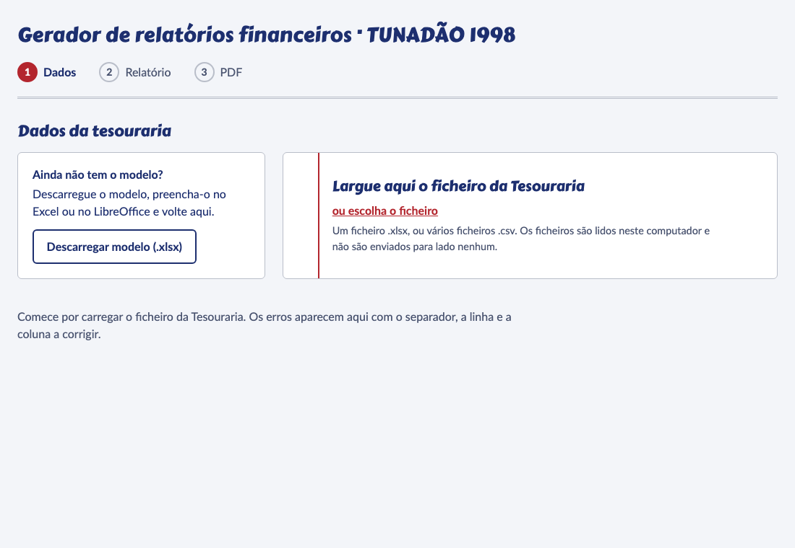
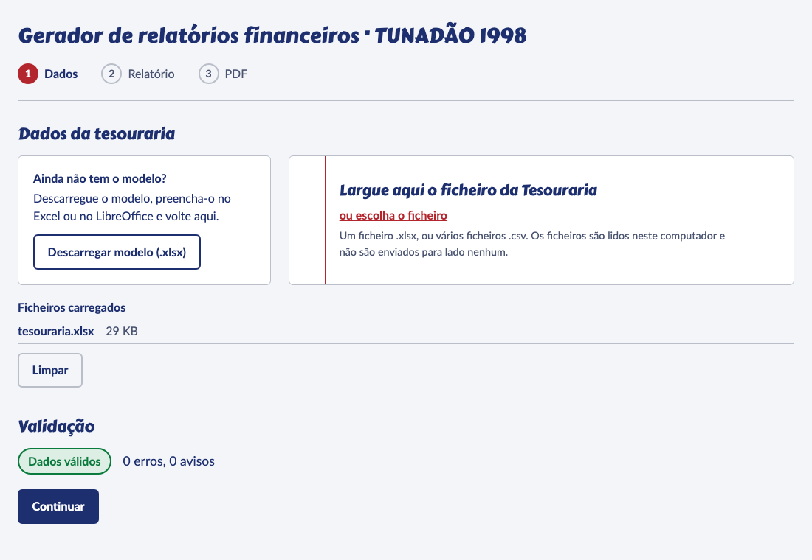
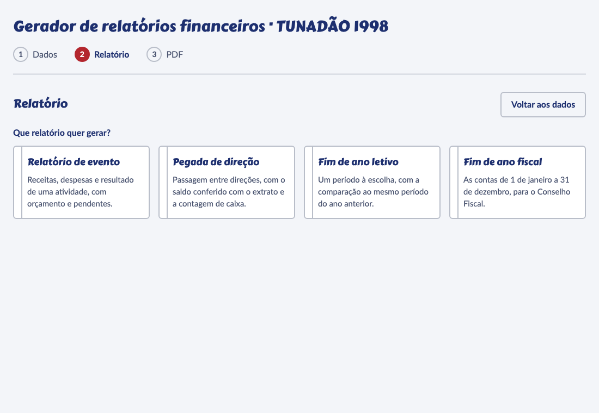
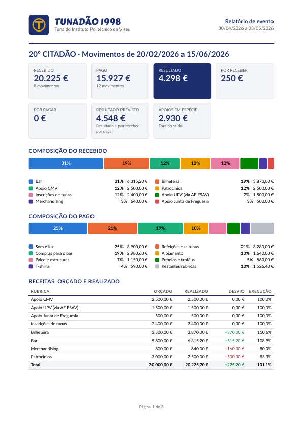

# Gerador de relatórios financeiros — TUNADÃO 1998

Página estática e CLI que leem a folha de Tesouraria (`.xlsx` ou CSV) e geram os relatórios financeiros da tuna em
PDF. Tudo acontece no navegador, neste computador: os dados nunca são enviados para lado nenhum. Depois da primeira
visita a página funciona também sem ligação à internet.

Há quatro relatórios: **Relatório de evento**, **Pegada de direção**, **Fim de ano letivo** e **Fim de ano fiscal**.

## Como usar a página



1. **Descarregue o modelo.** Na página inicial, o botão «Descarregar modelo (.xlsx)» dá-lhe a folha de Tesouraria
   vazia, com listas suspensas e uma aba **Instruções**. As linhas de exemplo são fictícias: apague-as antes de
   começar.
2. **Preencha cada aba** no Excel ou no LibreOffice:
   - **Movimentos**: cada recebimento e cada pagamento, com a data em que o dinheiro entrou ou saiu. O valor é sempre
     positivo; o sentido está na coluna Tipo (Entrada ou Saída). Escolha rubrica, sub-rubrica, atividade e meio nas
     listas suspensas. As colunas Conta, Valor com sinal e Conta para o resultado são calculadas: não as edite.
   - **Pendentes**: valores a receber e dívidas a pagar ainda não liquidados.
   - **Orçamento**: o orçado por rubrica, para uma atividade ou para um período (por exemplo «20º CITADÃO» ou «2026»).
   - **Géneros**: apoios em espécie. Ficam listados à parte e nunca entram no saldo.
   - **Saldos**: pontos de controlo do dinheiro de cada conta (Caixa ou Banco) no fim de um dia, com a fonte
     (Extrato, Contagem ou Declarado). A primeira linha de cada conta é o saldo de abertura: não o registe como
     movimento. A página confere cada ponto com o anterior e diz-lhe a diferença, se a houver.
   - **Listas**: as rubricas, sub-rubricas, atividades e meios que aparecem nas listas suspensas.
3. **Casos especiais nos Movimentos.**
   - _Reembolso_: se recebeu de volta dinheiro de uma despesa (por exemplo, uma caução), registe uma **Entrada com a
     rubrica dessa despesa**. O valor abate à despesa e não conta como receita.
   - _Transferência entre contas_ (por exemplo, depositar numerário no banco): duas linhas com a rubrica
     «Transferências internas», uma Saída na conta de origem e uma Entrada na de destino, com o mesmo valor e a
     mesma data. Não contam como receita nem despesa.
   - _Sub-rubrica_: é opcional. Vazia, o movimento fica na própria rubrica. A lista mostra todas as sub-rubricas;
     escolha uma que pertença à rubrica indicada.
4. **Uma atividade por edição de cada evento que se repete.** O relatório de evento soma todos os movimentos da
   atividade, por isso edições com o mesmo nome seriam juntas. Use, por exemplo, «Zumba na Caneca 2025» e «Zumba na
   Caneca 2026», nunca apenas «Zumba na Caneca». Acrescente cada nova atividade no fim da coluna Atividades da aba
   Listas.
5. **Carregue o ficheiro.** Largue o `.xlsx` (ou vários `.csv`, um por aba) na zona indicada. A página lê o ficheiro
   neste computador e mostra a validação.

   

6. **Corrija os erros.** Cada problema indica o ficheiro, a aba, a linha e a coluna, com uma sugestão. Os erros
   impedem a geração; os avisos não, mas ficam listados. Corrija a folha, volte a carregá-la e carregue em
   «Continuar» quando aparecer «Dados válidos». Um CSV que a página não reconhece abre um ecrã onde indica a que
   coluna corresponde cada campo; a escolha fica guardada neste navegador para a próxima vez.
7. **Escolha o relatório.**

   

8. **Preencha os parâmetros.** Os campos mudam com o relatório (atividade e datas do evento, data da passagem e
   contagem de caixa, período, ano fiscal, notas, parecer do Conselho Fiscal). Os problemas dos dados aparecem em
   direto.

   

9. **Gere e descarregue.** «Gerar PDF» compõe o relatório e mostra a pré-visualização. «Descarregar PDF» guarda o
   ficheiro; «Descarregar dados (.json)» guarda os números do relatório. «Alterar parâmetros» volta ao formulário.

   

Na primeira utilização a página descarrega o motor de PDF (cerca de 10 MB). Se carregar em «Gerar PDF» antes de ele
estar pronto, aparece «A preparar o motor de PDF… N %». Depois disso fica guardado no navegador e a página abre e
gera relatórios mesmo sem internet. Quando há uma versão nova, aparece «Nova versão disponível» com o botão
«Recarregar».

## Como gerar pela linha de comandos

Quem prefere o terminal (ou quer automatizar) usa `npm run gerar`, que corre o mesmo pipeline de `src/core` e o mesmo wasm do Typst que a página (`typst-node.ts`), sem
navegador. O JSON do relatório é o mesmo; o PDF não é idêntico byte a byte.

```
npm run gerar -- --tipo evento|pegada|letivo|fiscal --entrada <ficheiro> [--entrada <ficheiro> ...]
  [--params <ficheiro.json>] [--param chave=valor ...] [--saida <ficheiro.pdf>] [--json <ficheiro.json>]
  [--agora aaaa-mm-ddThh:mm] [--ajuda]
```

- `--entrada` aceita uma folha `.xlsx` ou um CSV por separador (repetir a opção).
- `--params` lê um ficheiro JSON com os parâmetros; `--param chave=valor` acrescenta ou substitui um parâmetro.
  Campos aninhados usam pontos (`--param aberturaManual.caixa=100`). Listas (indicadores, contagem de caixa) só
  podem vir do ficheiro JSON.
- `--saida` por omissão é `relatorio-<tipo>.pdf`. `--json` escreve também o JSON do relatório. Ambos substituem um
  ficheiro existente. `fixtures/params/*.json` mostra os parâmetros de cada tipo.
- `--agora` é a data e hora de geração em hora de Lisboa; por omissão, a hora atual de Lisboa.
- Os problemas dos dados saem em stderr, um por linha: `ERRO|AVISO <ficheiro> › <separador> linha N, coluna C:
mensagem (sugestão: ...)`.

| Código | Significado                                                         |
| ------ | ------------------------------------------------------------------- |
| 0      | PDF gerado (pode haver avisos)                                      |
| 1      | erros nos dados de entrada; nenhum PDF escrito                      |
| 2      | utilização incorreta: argumentos, ficheiros ou parâmetros inválidos |
| 3      | erro interno ao gerar o relatório ou o PDF                          |

Exemplos com os dados fictícios do repositório (a pasta `saida/` é ignorada pelo git e tem de existir):

```
mkdir -p saida
npm run gerar -- --tipo evento --entrada fixtures/generated/tesouraria.xlsx --params fixtures/params/evento-citadao.json --saida saida/evento.pdf
npm run gerar -- --tipo pegada --entrada fixtures/generated/tesouraria.xlsx --params fixtures/params/pegada-2026.json --saida saida/pegada.pdf
npm run gerar -- --tipo letivo --entrada fixtures/generated/tesouraria.xlsx --params fixtures/params/letivo-2025-26.json --saida saida/letivo.pdf
npm run gerar -- --tipo fiscal --entrada fixtures/generated/tesouraria.xlsx --params fixtures/params/fiscal-2025.json --saida saida/fiscal.pdf --json saida/fiscal.json
```

## Como mudar o logo, as rubricas, as cores e as assinaturas

| O quê                                      | Onde                                     | Como                                                                                                       |
| ------------------------------------------ | ---------------------------------------- | ---------------------------------------------------------------------------------------------------------- |
| Logo                                       | `assets/logo.svg`                        | Substitua o ficheiro por outro SVG (mantenha o nome). Aparece no cabeçalho dos PDFs.                       |
| Rubricas, sub-rubricas, atividades e meios | aba **Listas** do modelo                 | Acrescente ou altere linhas na própria folha. Não há nada para mudar no código.                            |
| Cores dos PDFs                             | `config/config.json`, chave `theme`      | Valores `#RRGGBB`. `segments` tem sempre 8 cores (gráficos) e `segmentInk` o texto legível sobre cada uma. |
| Cargos nas linhas de assinatura            | `config/config.json`, chave `signatures` | Uma lista de cargos por relatório (`evento`, `pegada`, `letivo`, `fiscal`).                                |
| Nome e subtítulo da tuna                   | `config/config.json`, chave `org`        | Texto livre.                                                                                               |

O logo e o `config.json` fazem parte da página publicada: depois de os alterar, faça commit para `main` e a
publicação refaz-se sozinha (ver a secção seguinte). Pelo CLI a alteração vale logo. Um `config.json` inválido
impede a página e o CLI de arrancar, com uma mensagem a dizer qual o campo errado.

## Como publicar no GitHub Pages

1. No repositório, abra **Settings → Pages** e escolha **GitHub Actions** em _Source_.
2. Cada push para `main` corre `.github/workflows/deploy.yml`: constrói a página, publica-a e corre um teste de
   fumo sobre o endereço publicado.
3. A página fica em `https://<utilizador>.github.io/<repositório>/`. O caminho base vem da variável de ambiente
   `BASE_PATH` (por omissão `/tunadao-relatorios/`). Se o repositório tiver outro nome, ou a página for servida a
   partir da raiz de um domínio, defina-a no passo de build, por exemplo `BASE_PATH=/outro-nome/ npm run build`
   (ou `BASE_PATH=/` para um domínio próprio).

## Secção de programador

### Stack

- TypeScript (modo estrito), Preact 11, Vite 8, Node 24 (`.nvmrc`).
- Folhas lidas com SheetJS CE 0.20.3 (`vendor/xlsx-0.20.3.tgz`, que não vem do registo npm) e Papa Parse para CSV.
- Zod 4 valida os dados, os parâmetros e `config/config.json`.
- PDFs compostos por Typst 0.14.2 em WebAssembly (`@myriaddreamin/typst.ts` e `@myriaddreamin/typst-ts-web-compiler`,
  ambos fixados em `0.7.0`).
- Vitest 5 e Playwright 1.63 para os testes. Todas as dependências estão fixadas sem intervalos de versões.

A regra de arquitetura: leitor → normalizador → dataset canónico → validador → calculador → JSON do relatório →
modelo Typst → PDF. O Typst só desenha números já calculados; todas as contas vivem em TypeScript puro, em
`src/core`.

### Scripts

| Script                                                                              | O que faz                                                                                          |
| ----------------------------------------------------------------------------------- | -------------------------------------------------------------------------------------------------- |
| `npm run dev` / `npm run preview`                                                   | servidor de desenvolvimento / pré-visualização do build                                            |
| `npm run build`                                                                     | build de produção (respeita `BASE_PATH`) e geração do service worker                               |
| `npm run format` / `format:fix`                                                     | verifica / aplica o Prettier                                                                       |
| `npm run lint` e `npm run typecheck`                                                | ESLint e `tsc --noEmit`                                                                            |
| `npm test`                                                                          | testes unitários e de fixtures (Vitest)                                                            |
| `npm run test:e2e`                                                                  | Playwright em chromium, firefox e webkit sobre o build, mais o servidor de desenvolvimento         |
| `npm run test:e2e:deployed`                                                         | fumo, motor e offline contra o endereço em `BASE_URL`                                              |
| `npm run test:visual`                                                               | gera os PDFs de exemplo e compara-os com `tests/visual/baselines` (precisa de `pdftoppm`)          |
| `npm run gerar`                                                                     | CLI                                                                                                |
| `npm run build:template`, `build:fixtures`, `build:example-json`, `render:examples` | regeneram os ficheiros gerados que estão no repositório; os testes verificam que estão atualizados |

### Fixtures e testes

- `fixtures/src` descreve um conjunto fictício e encadeado de janeiro de 2024 a setembro de 2026. `npm run
build:fixtures` escreve `fixtures/generated` (um `.xlsx`, o mesmo em CSV e conjuntos inválidos, um por classe de
  erro). Os testes em `tests/fixtures` afirmam os valores de controlo ao cêntimo.
- `fixtures/params/*.json` são os parâmetros de cada relatório de exemplo; `examples/*.json` os relatórios resultantes.
- `tests/e2e` cobre os percursos principais, a política de segurança (nenhum pedido a outras origens, `eval` e
  `new Function` bloqueados no worker) e o funcionamento offline.
- `tests/visual` rasteriza os PDFs de exemplo e compara-os com as imagens de referência.

### Modo offline

`scripts/service-worker-plugin.ts` gera `dist/sw.js` no fim do build a partir de `src/web/sw.ts`, com a lista de todos
os ficheiros construídos (incluindo o wasm, os tipos de letra, os modelos Typst e `modelo-tesouraria.xlsx`) e uma
versão derivada do conteúdo. O worker guarda tudo numa cache com essa versão, apaga as caches antigas ao ativar-se
e responde só a pedidos da própria origem; os restantes seguem para a rede. A CSP não muda. O registo
(`src/web/service-worker.ts`) só acontece em produção. Uma versão nova instala-se em segundo plano e fica à espera:
a página mostra «Nova versão disponível» e, ao carregar em «Recarregar», o worker novo assume e a página recarrega.
Sem esse clique, o worker novo assume quando o separador for fechado e reaberto.

O motor de PDF começa a carregar quando o navegador está livre. Na primeira visita (ainda sem service worker a controlar a
página) espera que o worker esteja ativo, para que o wasm seja descarregado uma só vez, pela pré-colocação em cache; se o
registo falhar, carrega na mesma.

O Playwright WebKit não consegue simular «offline» numa página servida por um service worker, por isso o percurso
offline corre em chromium e firefox e o webkit só verifica a cache. O Safari deve ser confirmado à mão no
endereço publicado.

### Motor de PDF

O PDF é composto por Typst, compilado em WebAssembly com `@myriaddreamin/typst.ts` e `@myriaddreamin/typst-ts-web-compiler`
(ambos fixados em `0.7.0`, que embute o Typst **0.14.2**). Os modelos usam apenas funcionalidades do Typst 0.14. O CI
compila `templates/hello.typ` com o Typst CLI 0.14.2 e confirma que o PDF só embute Lato e Carter One.

- `src/engine/typst-session.ts` constrói o compilador a partir de bytes (wasm, tipos de letra, modelos) e implementa
  `render(templateId, report)`. É partilhado pelo navegador e pelo Node.
- No navegador, `src/engine/typst-web.ts` lança um Web Worker (`render.worker.ts`) que descarrega o wasm e os ficheiros
  do próprio site; o carregamento só começa no primeiro `warmUp()` ou `render()`. O worker arranca a partir de um blob
  que importa o script real: um worker carregado diretamente do seu URL só obedece à CSP da sua própria resposta (o
  GitHub Pages não envia nenhuma), enquanto um worker de blob herda a CSP da página. O E2E confirma, nos três
  navegadores, que `new Function` está bloqueado dentro do worker.
- A cola JavaScript do `@myriaddreamin/typst-ts-web-compiler` chama `new Function` em cada arranque (cinco cadeias
  fixas). O `postinstall` corre `scripts/patch-typst-glue.ts`, que confirma que typst.ts e o web-compiler são exatamente
  a 0.7.0, troca essas chamadas por funções normais em `node_modules` (idempotente) e apaga `node_modules/.vite` para
  não sobreviver uma pré-compilação antiga. Serve o `npm run dev`, o build e o Node com o mesmo mecanismo, e a
  instalação falha se a cola mudar numa atualização do typst.ts. A CSP não leva `unsafe-eval`.
- No Node, `src/engine/typst-node.ts` lê **os mesmos bytes wasm** de `node_modules`; não é preciso
  `@myriaddreamin/typst-ts-node-compiler`.
- Os tipos de letra do Typst são passados como bytes e o carregamento de tipos de letra remotos fica desligado: os
  carregadores de série do typst.ts usam `new Function` (bloqueado pela CSP) e vão buscar tipos de letra a um CDN.
- A versão 0.7.0 só devolve avisos do compilador quando a compilação falha. Por isso `render` compila através de
  `runWithWorld`, onde os avisos (por exemplo `unknown font family`) chegam também em caso de sucesso. Glifos em falta
  não geram aviso nenhum; a cobertura é verificada por `src/engine/font-coverage.test.ts`, que lê a tabela `cmap` de cada
  tipo de letra, e o job `typst-cli` falha se o PDF embutir qualquer tipo de letra que não seja Lato ou Carter One.
- `assets/logo.svg` é um marcador provisório até haver o logótipo real.

### Tamanhos medidos

| Ficheiro                                | Tamanho                 |
| --------------------------------------- | ----------------------- |
| `typst_ts_web_compiler_bg.wasm` (bruto) | 28 325 178 B (27,0 MiB) |
| mesmo ficheiro, gzip -9                 | 10 733 234 B (10,2 MiB) |
| tipos de letra (5 TTF)                  | 2 800 908 B (2,7 MiB)   |

O primeiro PDF de teste, medido em `vite preview` local (sem rede real), fica pronto cerca de 0,1 s após o wasm
carregar e demora cerca de 0,2 s a compor. No GitHub Pages o wasm é transferido
com `content-encoding: gzip`: 10 854 723 B transferidos para 28 325 178 B em bruto. O Pages não serve brotli e envia
`cache-control: max-age=600`.

Licença: Apache-2.0.
